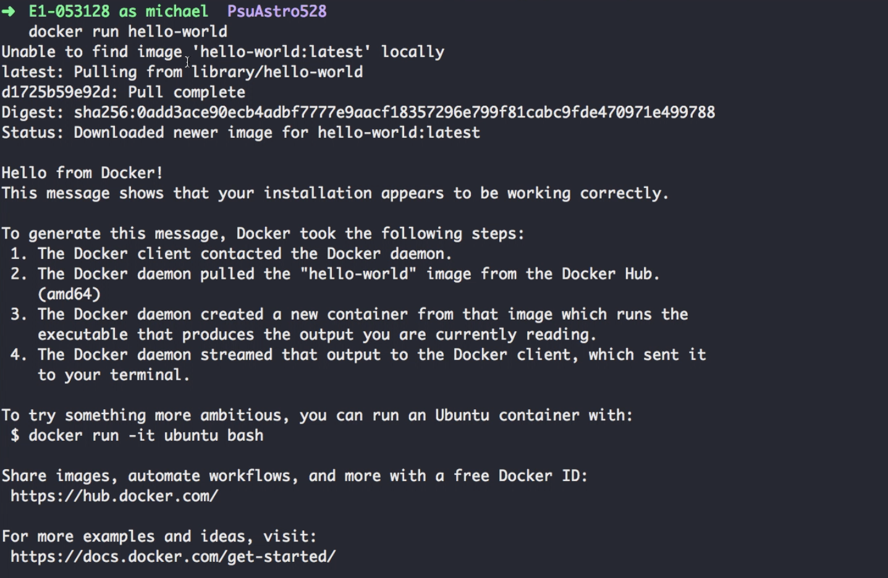
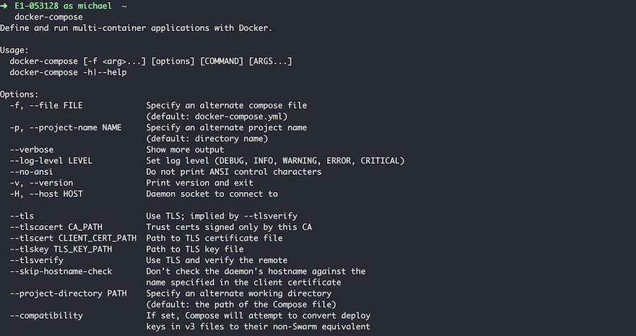
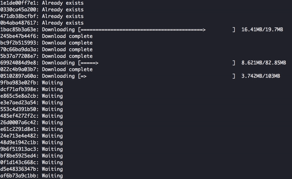

# Docker

Docker is a new container-based technology that aims to ease development and deployment workflows. Docker allows users to easily define and distrubute linux images and efficiently run those images as containers.

We have provided a Docker image that contains many necessary applications and languages required to complete assignements and projects. This enables you to complete assignments using your local computer. This page will illustrate how to install the provided Astro 528 Docker image and demonstrate its use.

## Installing Docker

<p style="max-width:500px;">
  
</p>

The easiest way to get Docker up and running on your machine is through an application called [Docker Desktop](https://www.docker.com/products/docker-desktop). This is available for Mac and Windows. Linux users can install [Docker CE addition](https://docs.docker.com/install/linux/docker-ce/ubuntu/) as well as [Docker Compose](https://docs.docker.com/compose/install/#install-compose) for Linux.


## Verify Docker Install

Before moving on, we need to verify docker and docker-compose is correctly working.

**Command**

```bash
docker run hello-world
```

**Expected Output**

<p style="max-width:500px;">
  
</p>

**Command**

```bash
docker-compose
```

**Expected Output**

<p style="max-width:500px;">
  
</p>

## Install PSU Astro 528 Notebook Docker Image

The next step will be to install the Docker image. This image will allow us to spawn containers to execute different processes we will need to complete assignments.

**Command**

```bash
docker pull psuastro528/notebook
```

**Expected Output**

<p style="max-width:500px;">
  
</p>


## Docker Containers Explained

Now that we have our Docker image installed, let's take a moment to breifly 